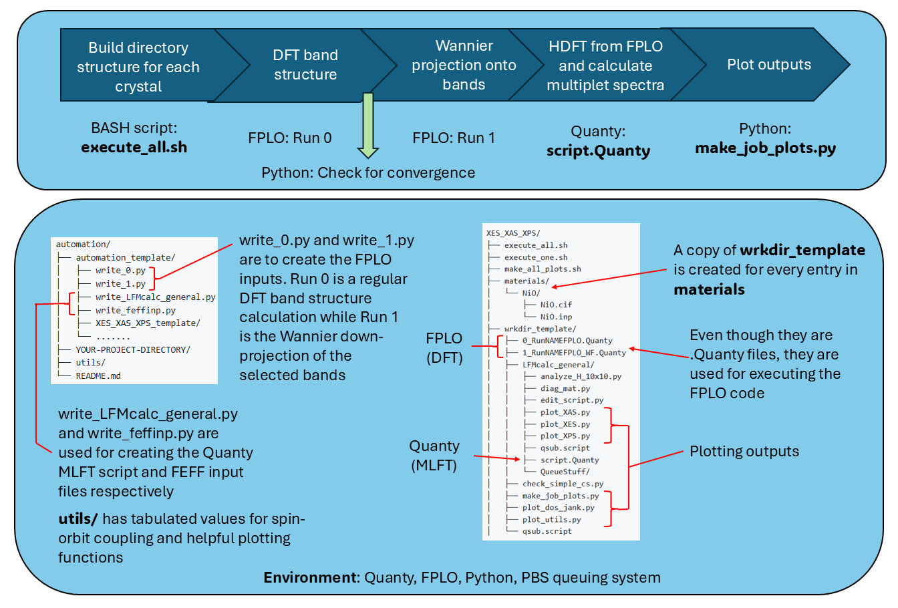

This repo is for the automation of nearly ab-initio Quanty calculations using the DFT + MLFT
pipeline established by Haverkort et. al (https://doi.org/10.1103/PhysRevB.85.165113). For information
about how to use this the (non python and bash) software in this pipeline, 
please visit the Quanty website (https://www.quanty.org/documentation/start),
specifically the example scripts from the Heidelberg workshops 
(https://www.quanty.org/workshop/heidelberg/october_2022/programme)

Over the years this repo has evolved into a patchwork combination of bash scripts and python plotting
utilities that basically no one but me understands. It's also been adapted to running similar
batch jobs of FEFF calculations, mostly for VtC-XES. This whole pipeline is customized to work on the Macchiato computing
cluster that belongs to the Rehr group at the University of Washington, including all the environtment and 
PBS queueing system dependencies that are it. This is not in any way intended for real users, 
and is mostly just a way for me to back up my scripts, please enter at your own risk.

For the FEFF automation specifically, a great alternative to my heaping pile of garbage 
would be using Corvus (https://github.com/times-software/Corvus).



### Getting Started

The automation scripts expect the following folder structure
```
automation/
├── automation_template/
│   ├── write_0.py
│   ├── write_1.py
│   ├── write_LFMcalc_general.py
│   ├── write_feffinp.py
│   ├── XAS_XES_XPS_template/
│   └── .......
├── YOUR-PROJECT-DIRECTORY/
├── utils/
└── README.md

```


Templates for automation pipelines are in the `automation_template` folder. Copy the one you would like to
use (ex: `automation_template/XAS_XES_XPS`) into the `automation` directory. This will be your main project
directory in which the automation scripts will run. Inside it will look something like

```
XAS_XES_XPS/
├── execute_all.sh
├── execute_one.sh
├── make_all_plots.sh
├── materials/
│   └── NiO/
│       ├── NiO.cif
│       └── NiO.inp
├── wrkdir_template/
│   ├── 0_RunNAMEFPLO.Quanty
│   ├── 1_RunNAMEFPLO_WF.Quanty
│   ├── LFMcalc_general/
│   │   ├── analyze_H_10x10.py
│   │   ├── diag_mat.py
│   │   ├── edit_script.py
│   │   ├── plot_XAS.py
│   │   ├── plot_XES.py
│   │   ├── plot_XPS.py
│   │   ├── qsub.script
│   │   ├── script.Quanty
│   │   └── QueueStuff/
│   ├── check_simple_cs.py
│   ├── make_job_plots.py
│   ├── plot_dos_jank.py
│   ├── plot_utils.py
│   └── qsub.script
```

Assuming that your environment is perfectly set up, all that is needed from a user is to create a folder
in `materials` for each 3d transition metal crystal they'd like to calculate. The .cif provides all the
chemical information, while the .inp specifies a few of the run parameters, which orbitals to include
in the Wannier down-projection, and the number of ligand atoms in the local cluster around the central atom.

#### Dependencies 
These automation scripts are built for running FPLO and Quanty together, or FEFF on it's own. There are also a number
of python file manipulation and plotting scripts.

##### Quanty and FPLO
- You will need to compile FPLO (https://www.fplo.de/get-a-license/) from source after getting approved for a license 
- Change the 0_RunNAMEFPLO.Quanty and 1_RunNAMEFPLO_WF.Quanty files to point at the appropriate executables
	- ex: FPLO  = "fplo14.00-49-x86_64"
	- ex: FEdit = "fedit14.00-49-x86_64"
- You will need to download the Quanty binary (https://www.quanty.org/download) and add it to your PATH

##### FEFF
- You will need to register and compile FEFF locally https://times-software.github.io/feff10/
- The scripts are set up for running the parallelized version of feff using mpi, so you will need compile it with that in mind

##### PBS Queuing System
- Throughout the templates there are many `qsub.script` files which are used for BASH scripting and batching the 
electronic structure calculations in a queue. If you don't have a queuing system, than some editing of pipeline scripts
will be necessary and things have to be run sequentially instead of everything being loaded into the queue and left to go.
- Alternatively, you can edit these to match with whatever queuing system (ex: Slurm) is setup on your own computing
cluster.

##### Python
- I used a conda environment which can be reproduced using the requirements.txt in this repo. Hopefully things should
just work out of the box, but some dependency debugging may be needed.
- Additionally, I used a customized version of pymatgen. The parts of the plotting scripts that depended on this have been
commented out, but if you have issues try updating to the latest stable version.
of pymatgen.

### Completed Run Example: NiO

An example of the output of the full pipeline for a single material is shown in the `output/NiO` folder in `XAS_XES_XPS_example`.
The output summary plots for the run can be seen in [📄 View NiO Summary (PDF)](XAS_XES_XPS_example/output/NiO/NiO_summary.pdf). 
This is created using `make_job_plots.py`.

```
NiO/
├── 0_RunNiOFPLO.Quanty
├── 1_RunNiOFPLO_WF.Quanty
├── DFT/
│   ├── +TNi_1_3dx2-y2.spin1
│   ├── +TNi_1_3dxy.spin1
│   ├── +TO_2_2px.spin1
│   ├── +out.wan
│   ├── +dos.total.l001
│   ├── +fkcor.001.1
│   └── ...
├── DFT_backup/
├── LFMcalc_general/
│   ├── H_10x10.dat
│   ├── XAS.dat
│   ├── XES.dat
│   ├── XPS.dat
│   ├── plot_XAS.py
│   ├── plot_XES.py
│   ├── plot_XPS.py
│   ├── write_LFMcalc_general.py
│   ├── QueueStuff/
│   ├── analyze_H_10x10.py
│   ├── edit_script.py
│   ├── diag_mat.py
│   ├── quanty.serr
│   ├── quanty.sout
│   ├── script.Quanty
│   └── ...
├── NiO_plots/
├── NiO_summary.pdf
├── __pycache__/
├── check_simple_cs.py
├── make_job_plots.py
├── plot_dos_jank.py
├── plot_utils.py
├── qsub.script
├── quanty.serr
├── quanty.sout
├── testing_0.out
├── testing_1.out
├── write_0.py
└── write_1.py
```
